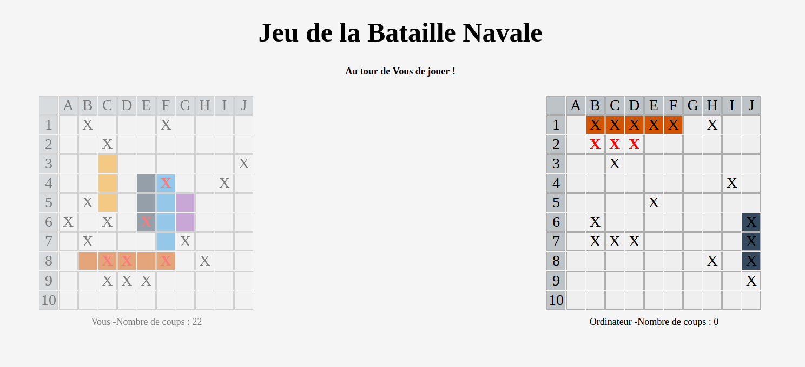

# Jeu de la bataille navale

## Fonctionnalités
- Jeu contre l'Ordinateur
- Choix de la taille de la grille
- Placement des baeaux aléatoirement
- Animations

## Règles du jeu
1. Charger la page **index.html**
2. Entrer le nombre de cases que vous souhaitez _(Compris entre 10 et 26 - 10 par défaut)_
3. Saisissez votre nom _('Vous' par défaut)_
4. L'ordinateur choisi aléatoirement les coordonnées de votre jeu **(à gauche)**
5. Pour attaquer votre adversaire, cliquer sur une case du jeu de l'ordinateur **(à droite)**

## About
- TP Javascript (MASTER 1 - Développeur Full-Stack)
- Javascript + Framework JQuery
- HTML, CSS (Utilisation de display-flex pour la grille)
- © **Dimitri Sandron** - _Février 2017_

#### Améliorations possibles
- Intelligence de l'ordinateur (attaquer autour de l'ancienne case touché)
- Plus de paramétrage (choix de la couleur des bateaux)
- Enregistrement en session ou en localStorage des données
